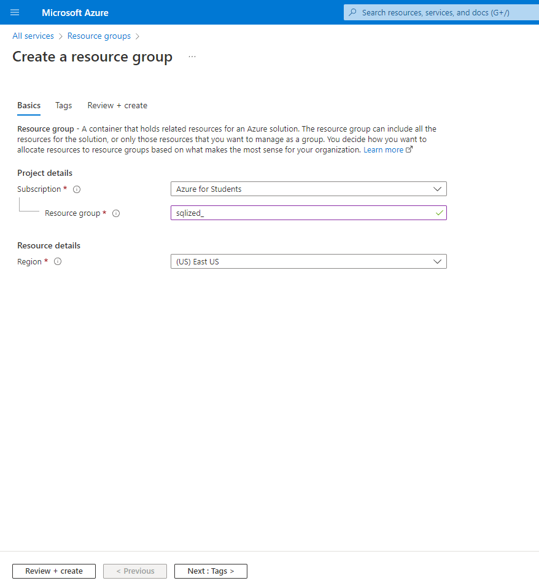
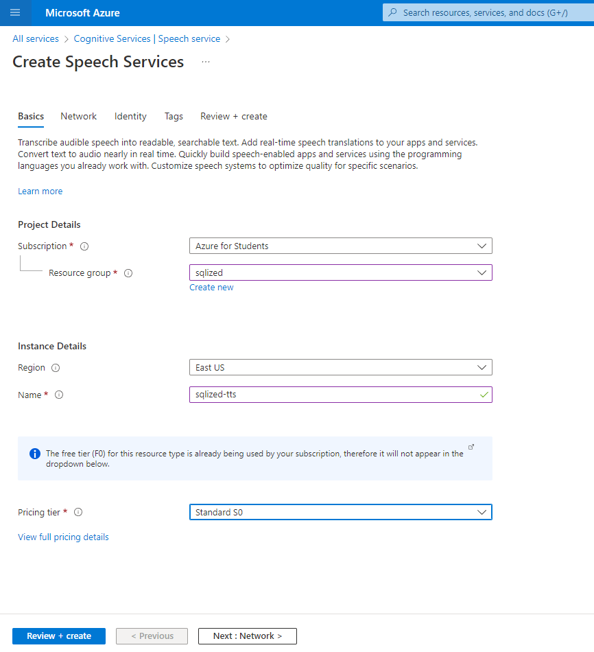
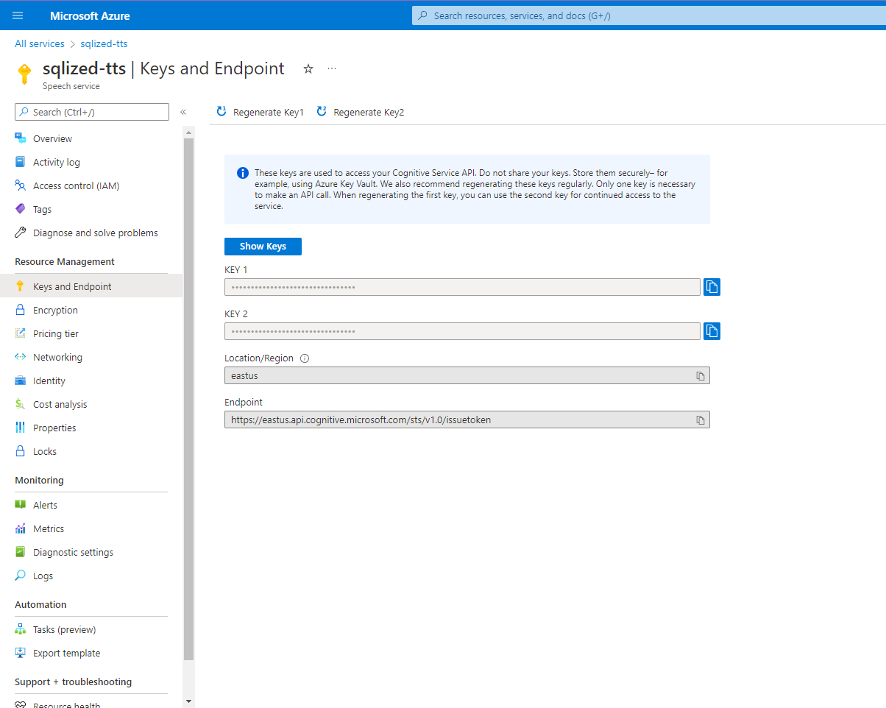
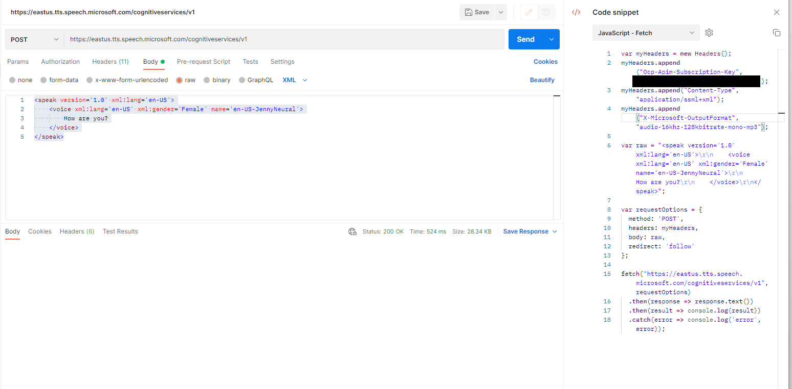
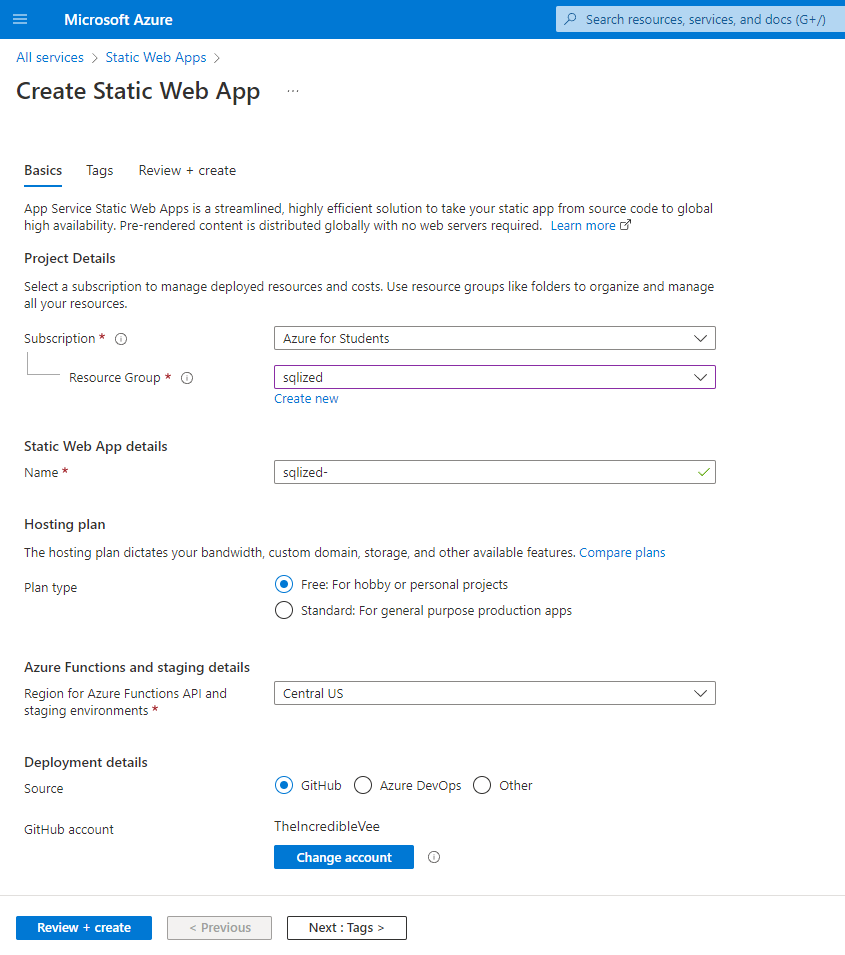
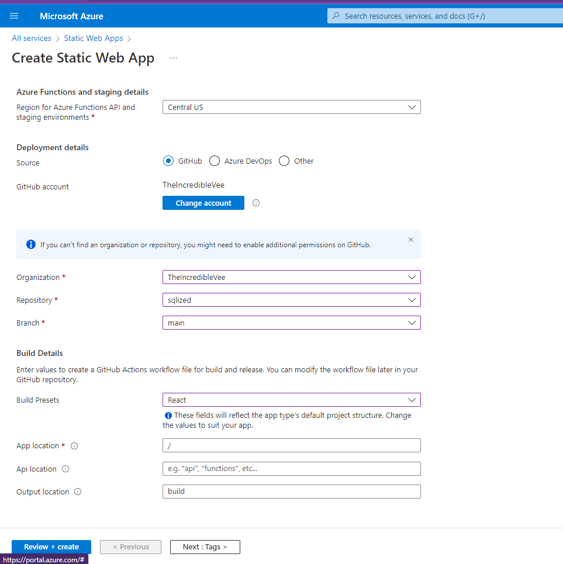

# Azure Deployment Steps

### Resource Group Creation

"A resource group is a container that holds related resources for an Azure solution. The resource group can include all the resources for the solution, or only those resources that you want to manage as a group. You decide how you want to allocate resources to resource groups based on what makes the most sense for your organization. Generally, add resources that share the same lifecycle to the same resource group so you can easily deploy, update, and delete them as a group.

The resource group stores metadata about the resources. Therefore, when you specify a location for the resource group, you are specifying where that metadata is stored. For compliance reasons, you may need to ensure that your data is stored in a particular region." taken from [azure docs](https://docs.microsoft.com/en-us/azure/azure-resource-manager/management/manage-resource-groups-portal)

* Sign in to the [Azure Dashboard](https://portal.azure.com/)
* Search Resource Groups and press enter
* Click on create button
* Choose Subscription and then give the name (sqlized) 
* Review + create and then create



### Speech Service Creation

* Sign in to the [Azure Dashboard](https://portal.azure.com)
* Search Speech Services and press enter
* Click on create button
* Choose Subscription and then select the resource group created above ( sqlized )
* Give an Instance name of your choice (sqlized-tts)
* Choose Pricing in our case S0
* Review + create and then create



### Speech Service API testing

Here I used postman for testing

* Sign in to the [Azure Dashboard](https://portal.azure.com)
* Open the speech service created above (sqlized-tts)
* Go to keys and endpoint
* Click one show keys
* Copy any one of the two keys provided
* Open postman(or any other API calling Application)
* Create a new HTTPS request
* Set the following parameters:
    METHOD:     POST

    URL:    https://<Region>.tts.speech.microsoft.com/cognitiveservices/v1
    >In our case the url is https://eastus.tts.speech.microsoft.com/cognitiveservices/v1

    HEADERS:    
    ```
        Ocp-Apim-Subscription-Key :  <KEY COPIED>
        Content-Type : application/ssml+xml
        X-Microsoft-OutputFormat : audio-16khz-128kbitrate-mono-mp3
    ```
    BODY( as raw):  
    ```     
        <speak version='1.0' xml:lang='en-US'>
            <voice xml:lang='en-US' xml:gender='Female' name='en-US-JennyNeural'>
                How are you?(TEXT TO CONVERT TO SPEECH)
            </voice>
        </speak>
    ```
    Read More [here](https://docs.microsoft.com/en-us/azure/cognitive-services/speech-service/rest-text-to-speech)
* Click the dropdown on left of Send and choose Send and Download
* Choose the download location

The downloaded file will be the speech conversion of the text entered in the body of the request.






### Deployment of the Website

* Sign in to the [Azure Dashboard](https://portal.azure.com)
* Search Static Web Apps and press enter
* Click on create button
* Choose the Subscription and resource group(sqlized)
* Enter a unique name for the App(sqlized)
* Choose Plan type(Free)
* Choose hosting location
* Choose source as Github and link the github account
* Organization -> github username(theincrediblevee)
* Choose repository(sqlized) and branch(main)
* Choose Build Presets as React
* Select App location as / 
* Select Output location as dist(as we are using vite and it creates dist folder instated of build that webpack creates)
* Press Review + Create and then create

Deployment will take sometime depending on the App size and location. 
You can check the process by clicking on the Actions tab on the GitHub Repository and change any config via the .yml file in .github/workflows folder.
Link of deployment App will be there in the Resource as well as the GitHub repository






