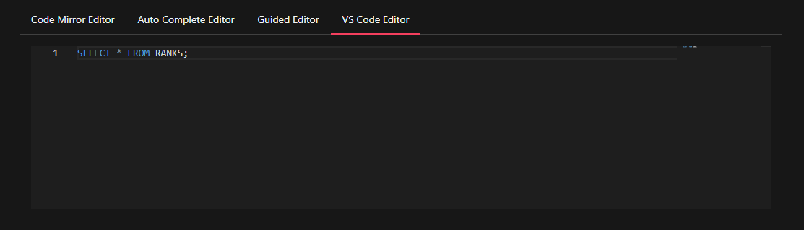
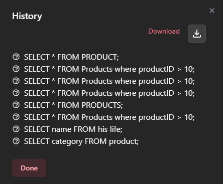
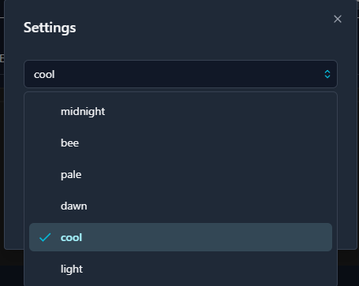
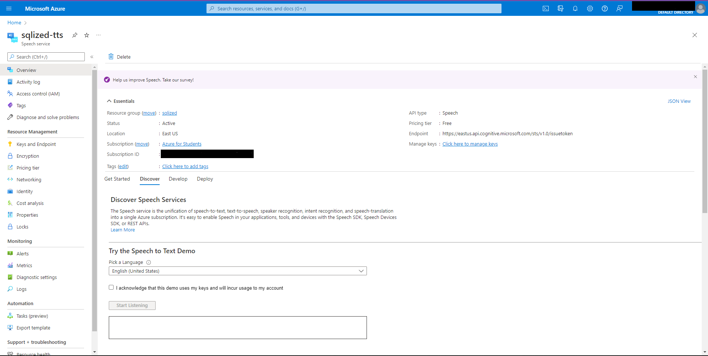
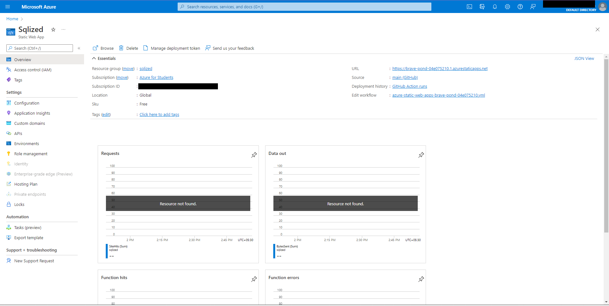
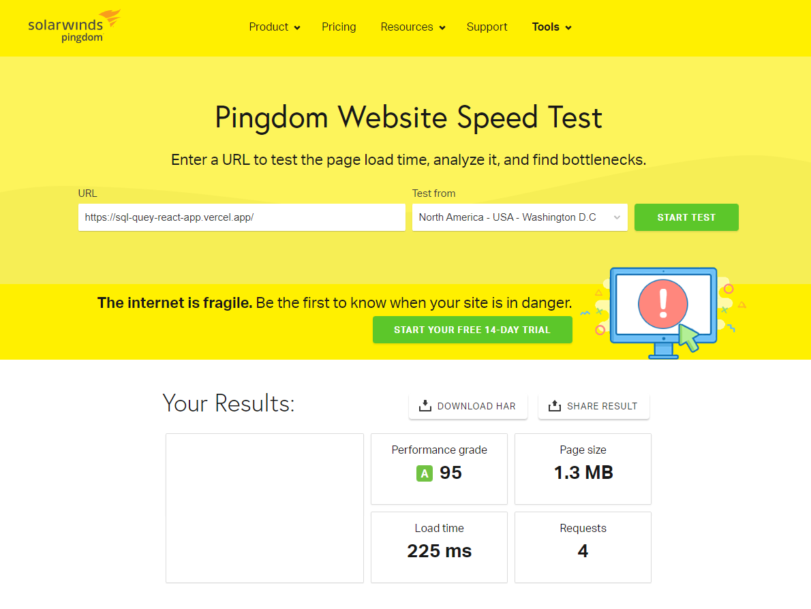
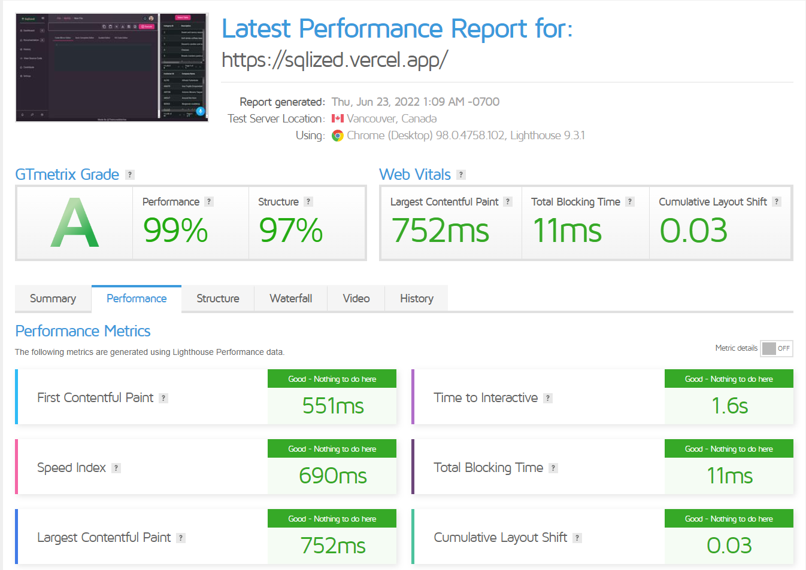

<h1 align="center">
  
  <br>
</h1>
<p align="center" style="font-size: 1.2rem;">Easy to use, flexible, and user-friendly SQL running app with voice command support</p>
<hr />

## The problem (Outline)

Create, design and implement a web-based application capable of running SQL queries and displaying the results of said query. The application must include a space which accepts SQL queries in the form of user inputs, then runs the given query, and displays the result within the application.

## This solution

The app offer a react UI-UX experience coupled with a bunch of cool and exiting features to that comes in handy and make the entire process of writing and implementing SQL queries seamless, easy, interactive and handy. Some of the MSP's are mentioned below.

- [Multiple Text Editor](#multiple-editors) for a wide range of users, starting from absolute beginnner to advanced.
- [Table Options](#table-options) for sorting, editing and pagination of rows to better understand the data.
- [Multiple Themes](#theming) for rich and worthy user experience

### SQLized

This is a app that takes in SQL queries fro the user and executes the commands and return display's the output in a well formatted tables.

> NOTE: The original use case of this app is to execute SQL queries, however this is also
> powerful and flexible enough to work on tables alone, edit Records and much more.

## Table of Contents

<!-- START doctoc generated TOC please keep comment here to allow auto update -->

<!-- DON'T EDIT THIS SECTION, INSTEAD RE-RUN doctoc TO UPDATE -->

- [Installation](#installation)
- [Usage](#usage)
- [Demo](#demo)
- [Feature](#features)
  - [Multiple Editors](#multiple-editors)
  - [View History](#view-history)
  - [Table Options](#table-options)
  - [Voice Recognition](#voice-recognition)
  - [ToolBox Options(Cut, Copy, Clear, Upload, Download, Read Out Loud)](#toolbox-options)
  - [Theming](#theming)
- [Tech Stack](#tech-stack)
- [Azure Technologies used](#azure-technologies-used)
  - [Speech Services](#speech-services)
  - [Static Web App](#static-web-apps)
- [Packages and Libraries](#packages-and-libraries)
- [Speed](#speed)
- [Optimizations](#optimizations)
- [Future Scope](#future-scope)
- [Contributors](#contributors)
- [LICENSE](#license)

<!-- END doctoc generated TOC please keep comment here to allow auto update -->

## Installation

This module is made via [yarn][yarn] which is bundled with [Vite][vite]. To install the app simply run the following command:

```
yarn 
```

## Usage

Try out the app which is available to try using the link mentioned below:(Deployed using [Vercel][vercel] )

> [Try it out in the browser][deployment-link]

> Warning: For best User Experience, visit the website on `Desktop`.

## Demo

Below is a Gif demonstracting the app and it's various features that are available for the users to try out.


## Features

Below I've provided all of the features for the app and also mentioned their limitations

### Multiple Editors

So, the choice of using muliple text editor is based on the fact that there is a lot of diversity in the data Science field, there are people ranging from beginners to advanced level. So, in order the curate this wide variety of user base, there are mainly 4 different text editor for the user to enter their queries.

#### [Code Mirror Editor][code-mirror]

Aimed for the more intermediate and advanced users who are comfortable writing code, have worked on IntellSense based Text editors and want to use use shortcuts to perform actins more quickly and efficiently.

Below is a screenshot of the editor.


#### [Auto Complete Editor][react-autocorrect-input]

This is a simple text based input field for those users that don't want a full fledged code editor but still wants the feature of auto complete in the input field.

Below is a screenshot of the editor.


#### Guided Editor

This is a custom made editor just for the most basic user and beginners who have hard time remembering the syntax and have to keep looking at tha manual time after time. Using this user won't have to switch between the the docs and the site. They can just focus on the understand the concpets and implementing the SQL queries without woring about refering the docs again and again.

Below is a screenshot of the editor.


#### [VS Code (Monaco) Editor][monaco-editor]

One of the most popular and most used text-editor out there. For a lot of folks into this industry they have been using VS Code for a long time and are used to working on it. Most users would prefer this based on their prior experience with VS Code.

Below is a screenshot of the editor.



### View History

This feaure is added to view the user's history of queries that he/she have executed. Currently it is stored in localStorage and would reset on hard reload or manual deletion. There are plans to adding this to a Database that is tied up to each user in their dashboard.
Anyone can download the history in .sql file.

Below is a screenshot of the editor.



### Table Options

In order to better understand the data stored in form of tables, there are a few optinos provided to the user in terms of Tables. These are

- [Pagination][pagination]
- [Edit Tables Cells][edit-table-cells]
- [Sorting Records based on a Column][sorting]

### Voice Recognition

This is still in testing and limited to a few queries for now. This is based on the same idea about ease to use as was for the [Guided Editor][guided-editor]. One can just use this app while dowing other things on the side, say having lunch, etc.

### ToolBox Options(Cut, Copy, Clear, Upload, Download, Paste, Execute)

This is by far one of the most basic and useful feature that is missing in most of the basic apps out there. Options that have been implemented includes:

- Copy
- Paste
- Clear
- Upload
- Download
- Execute
- Read out loud (using Azure Speech Services)

### Theming

Themes help to enhance the overall UI-UX of an app and make it more attractive and hence bringing more user base to try out the app.

- [Light][vechai-theme]
  - [Light][vechai-theme]
  - [Bee][vechai-theme]
- [Dark][vechai-theme]
  - [Dawn][vechai-theme]
  - [Midnight][vechai-theme]
  - [Cool][vechai-theme]
  - [pale][vechai-theme]

Below is a dropdown for choosing the desired theme.



## Tech Stack

This app is primarily based on [React][create-react-app] while build with [Vite][vite] instead of the default [Webpack][webpack] out there, as Vite is better in terms of speed and performance. Also, instead of using typical npm, have used yarn while making the app. Not toh mention that for managing state have used Context API as the project size was small. Later on adding complexity might call a need for Redux.

> Node version used - `14.0.0`

## Azure Technologies used

This app is primarily based on [React][create-react-app] while build with [Vite][vite] and is using two most popular Azure core technologies out there which are mentioned in detail below. These technologies were added to enhance the user experience and add more usability into the webapp. To view the deployment steps, view the [DEPLOY_DOC.md](./DEPLOY_DOC.md)

The technologies used are as follows:

### Speech Services

The main purpose behind using Speech service was to make the user hear out the input they have typed or copied. In case of small input of about 1-2 lines, this might not seem useful. But, this feature was added keeping in mind that there is another feature wehere in user can [upload](#toolbox-optionscut-copy-clear-upload-download-paste-execute) files as an input that might contain a lot of code, and the user can just hear the input while working on something in background or say while having dinner.



The way this feature is implemented is that I've used the REST API provided by Azure Speech Services and it return an audio file which have been parsed as blob and then converted to a new Audio() object so that it can be played in the browser as soon as someone clicks that read Listen button on the tool box.

For more information read the documentation of [Azure Speech Services](azure-speech-doc)


### Static Web Apps

The main purpose behind using Static Web Apps was to deploy the web app onto the internet so that anyone can access it. Apart from just deployment, Azure Static Web App also provides the ability of adding CI/CD (Continuous Integration/ Continuous Deployment). There is a [.yml file](.github/workflows/azure-static-web-apps-brave-pond-04e075210.yml) that is added to the path .github/workflows that helps us achieve the result. So, when there is a commit made on the main branch or a PR is merged on the main branch, the GitHub actions runs the script and deploys the app automatically. In case of any failures or warnings, anyone can view the log by clicking on the Actions tab.



For more information read the documentation of [Azure Web Apps](azure-static-web-apps-doc)

## Packages and libraries Used

Below is a list of all the Packages and libraries used for making the app.

### [Alan AI + Alan studio][alan-ai] - `1.8.34`

Used for the purpose of proving the voice input functionality to the user.

### [Code Mirror][code-mirror] - `4.9.3`

Used to provide a rich text editor for intermediate and advanced level users. Auto complete and color formatting provided for SQL.

### [Headless UI][headless-ui] - `1.6.4`

Used for the purpose of providing beautiful UI component and functionality.

### [Monaco Editor][monaco-editor] - `4.45`

Used for taking input from the users familiar with VS Code. Color Formatting Provided for SQL

### [Hero Icons][hero-icons] - `1.0.6`

Used for the purpose of providing beautiful UI components and Icons.

### [React Maker][react-autocorrect-input] - `1.0.2`

Used for provideding input field that has custom auto complete dropdown.

### [TailWind CSS][tailwind] - `3.1.3`

Used for designing and making the UI more appealing.

### [VechaiUI][vechai-ui] - `0.2.2`

Used for most part of the app to provided customized theming and lot of UI components.

### [AG Grid Community][ag-grid-community] - `27.3.0`

Used for displaying the tables, sorting them, editing and adding pagination.

### [Papa Parse][papa-parse] - `5.3.2`

Used for parsing the excel and csv files uploaded by the users and extract information need.

### [React Icons][react-icons] - `4.4.0`

Used for the purpose of providing beautiful UI components and Icons.

## Speed

Page Load time is coming somewhat around decent as compared to other such similar react app apps with similar functionality. Used a couple of speed testing websites to check the matrix whose Screenshots have been provided below.

Give the fact that the app has [Alan AI Voice Recognition][alan-ai] and [AG Grid Commpunity][ag-grid-community] that have their own complexities, the speed of the website comes out to be really good.





## Optimizations Done

Used useMemo and useCallback hooks for memorization puropse in a lot of places. Moreover, choose Vite over webpack also grave a much needed boost to the final speed of the app. Using gobal variables only when necessary. Will be doing more optimizations like re-reselect, lazy Loading plus using cache memory proficiently.

## Future Scope

In addition to improving the alreay implemented features, am also looking forwards towards adding the backend, creating a dashboard for the user and adding plans based on which they can make limited calls per day, adding visualization for the tables, plus adding login and signup routes as well. Not to forget to mention to make the app more responsive that it currently is.

## [Contributors](#contributors)

[TheIncredibleVee][theincrediblevee]

## Contributors

Thanks goes to these people:

<!-- ALL-CONTRIBUTORS-LIST:START - Do not remove or modify this section -->

<!-- prettier-ignore-start -->

<!-- markdownlint-disable -->

<table>
  <tr>
    <td align="center"><a href="https://www.github.com/theincrediblevee"><br /><sub><b>TheIncredibleVee</b></sub></a><br /><a href="https://github.com/sqlized/commits?author=theincrediblevee" title="Code">💻</a> <a href="" title="Reviewed Pull Requests">👀</a><a href="#example-kentcdodds" title="Examples">💡</a> </td>
</tr>
</table>

Contributions of any kind are welcome!

## LICENSE

MIT

[create-react-app]: https://reactjs.org/docs/create-a-new-react-app.html
[webpack]: https://webpack.js.org/
[yarn]: https://yarnpkg.com/
[vite]: https://vitejs.dev/
[npm]: https://www.npmjs.com/
[node]: https://nodejs.org
[alan-ai]: https://alan.app/platform
[monaco-editor]: https://www.npmjs.com/package/@monaco-editor/react
[code-mirror]: https://www.npmjs.com/package/react-codemirror
[headless-ui]: https://headlessui.dev/
[hero-icons]: https://www.npmjs.com/package/@heroicons/react
[deployment-link]: https://sqlized.vercel.app/
[react-autocorrect-input]: https://www.npmjs.com/package/@webscopeio/react-textarea-autocomplete
[tailwind]: https://tailwindcss.com/docs/guides/create-react-app
[vechai-ui]: https://www.vechaiui.com/
[ag-grid-community]: https://www.ag-grid.com/react-data-grid/reactui/
[papa-parse]: https://www.npmjs.com/package/react-papaparse
[react-icons]: https://www.npmjs.com/package/react-icons
[pagination]: https://www.ag-grid.com/react-data-grid/server-side-model-pagination/
[edit-table-cells]: https://www.ag-grid.com/react-data-grid/cell-editing/
[sorting]: https://www.ag-grid.com/react-data-grid/row-sorting/
[vechai-theme]: https://www.vechaiui.com/themes-gallery/
[theincrediblevee]: https://www.github.com/theincrediblevee
[azure-static-web-apps-doc]: https://azure.microsoft.com/en-us/services/app-service/static/
[azure-speech-doc]: https://azure.microsoft.com/en-us/services/cognitive-services/speech-services/
